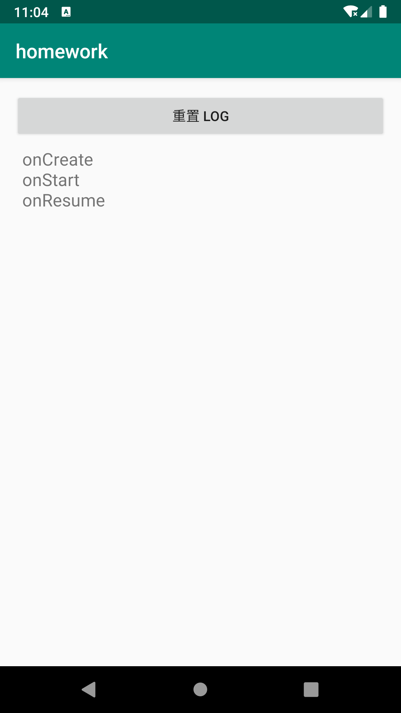
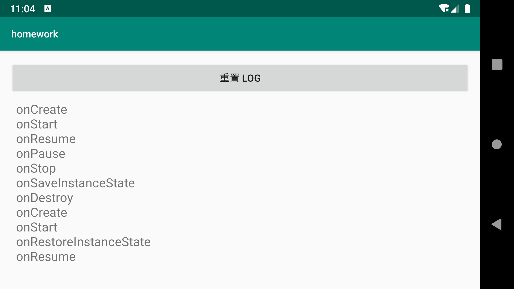
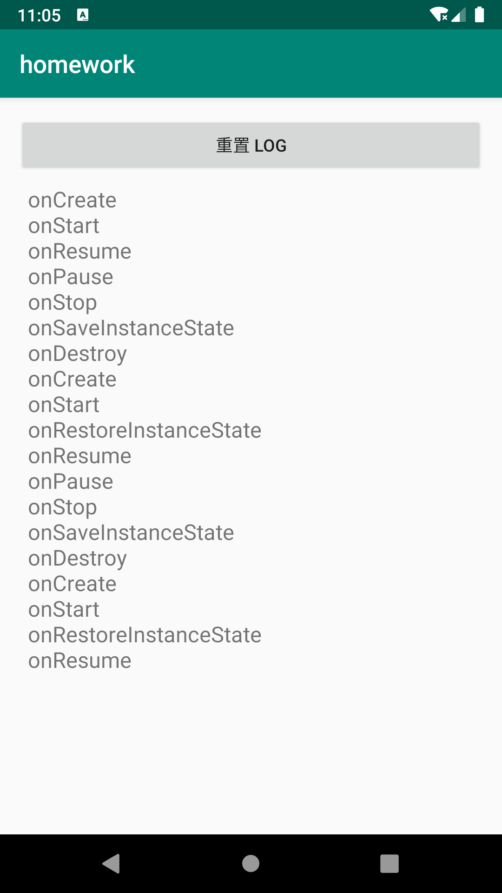
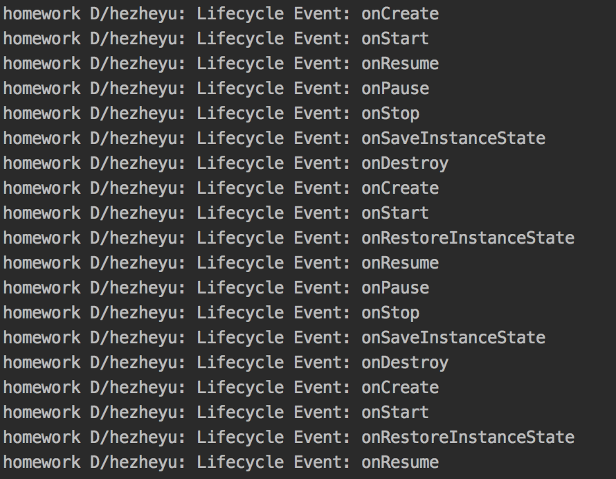
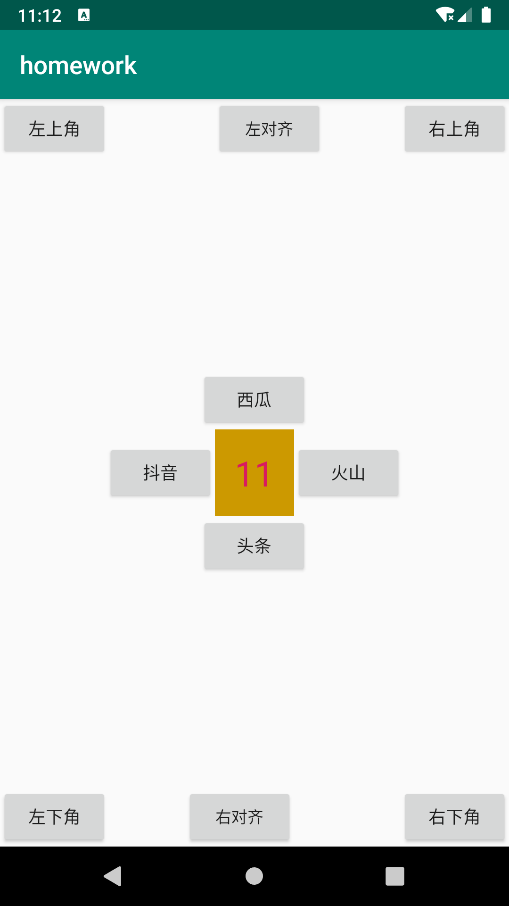
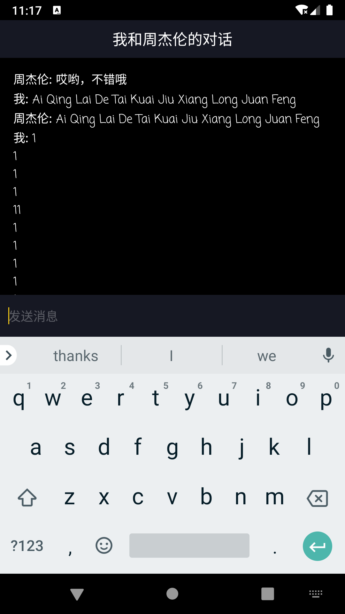
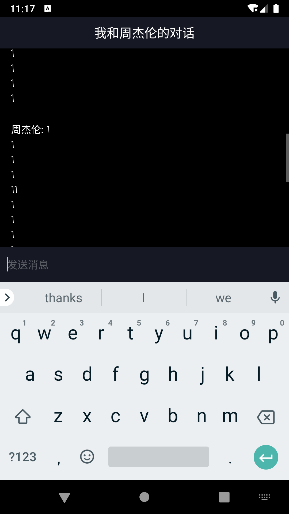

# 2020/3/23 作业二

1. Logcat在屏幕旋转的时候 `onStop()` 和 `onDestroy()` 会展示出来，但UI界面我们看不到，在今天课程基础上想办法补全它，让其跟 Logcat 的展示一样。

	**解题过程**：本题使用比 `Acitivity` 生命周期更长的 `Application` 来保存 `onSaveInstanceState()` 之后的 Log，并在重启之后将 Log 字符串返回给 `TextView`。
	
	**演示效果**：
	
	一开始的竖屏：
	
	横屏之后：
	
	再竖屏回来：
	
	可见上述在 UI 界面显示的内容和 Logcat 中一致：
	
	
2. 一个抖音笔试题：统计页面所有 view 的个数。ViewGroup 中的 API: `getChildCount()`, `getChildAt()`。

	**解题过程**：整个 `ViewGroup` 其实就是一个广义表，`ViewGroup` 中可以继续有 `ViewGroup` 或 `View`（当然也可以为空）。所以要遍历广义表（或者可以称之为多叉树，因为一开始有一个根），可以采用广度优先搜索或深度优先搜索。在这里我不想用递归，所以采用了广度优先搜索。
	
	**演示效果**：
	我删除了两个组件，显示总共为 11：
	

3. 实现一个类似抖音消息页面，并且点击每个 `RecycleView` 的 item，能够跳转到一个新的界面，并且在新的页面显示出他是第几个 item。

	**解题过程**：此题的难点在于如何把解析完的数据传给 `Adapter`。不过其实也很简单，就是在生成 `Adapter` 实例是将数据传给它，即在构造函数加一个参数即可。然后再为聊天室新加一个 `Activity` 来实现，简单起见，所有聊天消息都存于一个 `TextView` 中。开发聊天室的过程中要注意的是 `EditText` 要监听是否有输入来开启或关闭发送按钮。
	
	**TODO**：想把对话做成气泡的形式。实现这个像消息列表里一样使用 `RecyclerView`，并使用 9Patch 图来实现气泡的拉伸。
	
	**演示效果**：
	消息列表：简单起见没有去重，也没有按时间排序。
	
	聊天界面：使用了可以拖动的 `ScrollView`。
	
	
	
	