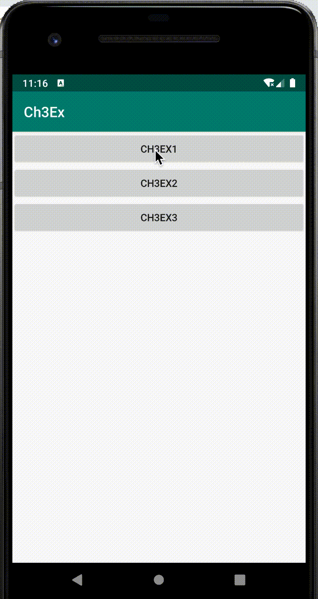

## 2020/3/29 作业三

1. 引入 Lottie 库实现简单的图标动画

   1. 在 activity_main.xml 中添加 `LottieAnimationView`
2. 在 `SeekBar` 的回调中修改 `LottieAnimationView` 的进度
   

​	**演示效果**

1. 使用属性动画，练习 `AnimatorSet` 和 `scale`/`fade` 等基本动画样式

   1. 添加 `scale` 动画

   2. 添加 `alpha` 动画

   3. 组合到 `AnimatorSet` 中

2. 使用 `ViewPager` 和 `Fragment` 做一个简单版的好友列表界面

   1. 使用 `ViewPager` 和 `Fragment` 做个可滑动界面

   2. 使用 `TabLayout` 添加 Tab 支持

   3. 对于好友列表 `Fragment`，使用 Lottie 实现 Loading 效果，在 5s 后展示实际的列表，要求这里的动效是淡入淡出